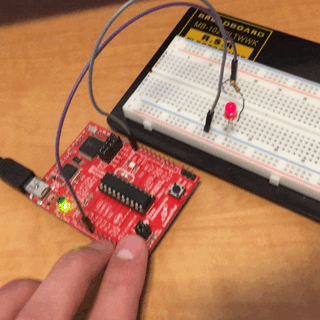

## Mitchell Hay

# Hardware PWM
The hardware PWM part of this lab is very similar to the software side of it. Instead of using timer interrupts to light up the LEDs, we can make one of the GPIO pins the output of PWM. There still is the button function where the brightness goes up 10% every button press, but this time it would be an off-board LED being lit up. The hardware PWM circuit can be seen below.

# Devices
* MSP430F5529
* MSP430FR2311
* MSP430FR5994
* MSP430FR6989
* MSP430G2553

# Getting Started
## Dependencies
Each device requires no outside dependencies. Everything needed to run the program is included in the folder. Each folder is labeled with the device it is meant for.
## Setup
Each of the device projects in this part of the lab can be imported into Code Composer Studio and run from there. To import it, open CCS and select File -> Import -> Code Composer Studio -> CCS Project and select the desired directory.

# Functionality
## Usage
The user presses a button to increase the brightness of an LED. The LED eventually resets back to off when it cannot get any brighter.
## Off-Board
This part of the lab required a breadboard as well. The GPIO pin was selected for each of the microprocessors, so attach the output of the GPIO pin to a small resistor (1kOhm) in series with the LED. Running the program normally will output the PWM signal onto the GPIO pin, which will be shown on the breadboard.

# Known Errors
There are no known errors at this time

# Tasks
* [x] Use the PWM module on GPIO pins
